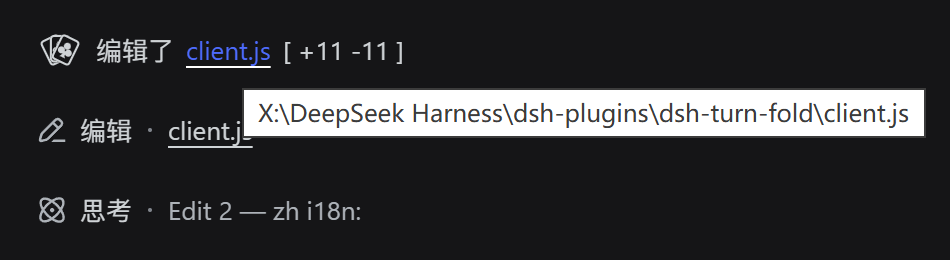
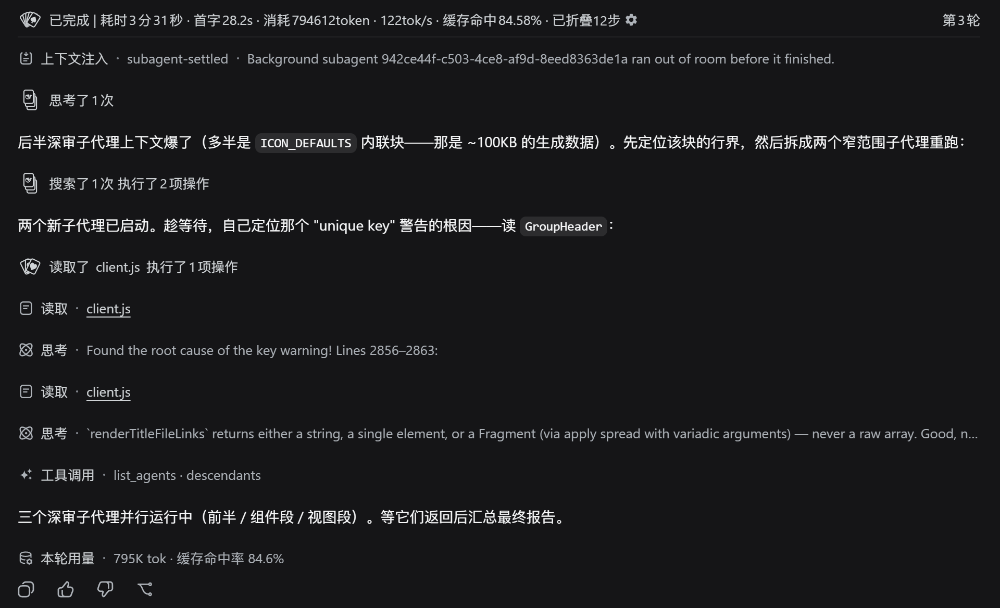
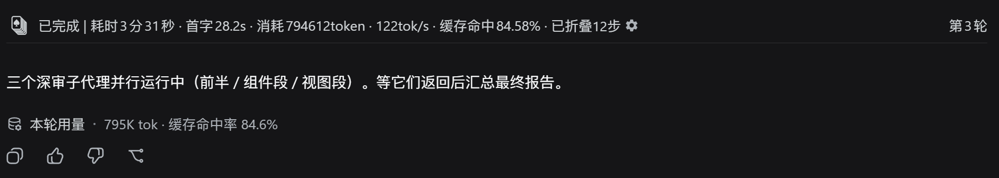
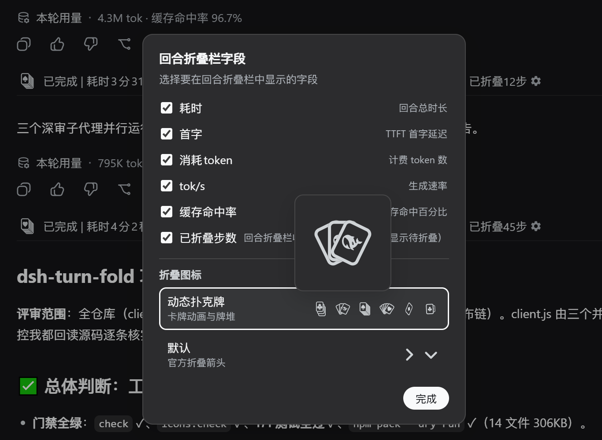

# dsh-turn-fold

> [简体中文](README.md)（默认） | **English**

> Tired of dozens of tool calls filling your screen?
> Envious of Codex's auto-collapse next door?
> Then this plugin is made for you.

A **pure plugin** for DeepSeek Harness (DSH) that only handles **collapsing**:
1. **Segment-level auto-collapse**: all tool calls and Think blocks (including Think-only segments) between two text messages are grouped into **one step fold bar**, **collapsed by default**; while running, the header dynamically shows "Running `icon ToolName` · description" or "Thinking `icon Think` · content" (text with a shimmer gloss animation), switching to a tool-type-grouped detailed title (e.g. "Ran pwsh", "Read client.js", "Edited index.js [ +12 -3 ]") once the next text message appears; a Think-only segment shows "Thought N times" when closed.
2. **Live turn fold bar**: appears **immediately when you send a message** (0-second placeholder, no waiting for the first response); the header shows duration / TTFT / tokens / tok/s / cache-hit rate in real time, with "Turn N" right-aligned on the far right, separated from the content by a divider line.
3. **Whole-turn collapse**: after a reply finishes, all Think blocks + tool calls + context injections of that turn collapse into **a turn fold bar** (collapsed by default); only the final summary text stays visible.
4. **Manual expand/collapse**: click a fold bar to toggle.
5. **Per-version "What's new" notice**: shows the release notes once, right after each new version is first loaded (read-version is stored locally, so it never nags again).

**Does not modify any `@deepseek-ai/dsh-*` source code.**

## Feature 1: Segment-level auto-collapse

```
text: First, check the repo status.                    ← text appears directly
┌────────────────────────────────────────────────────┐
│ › Running ⬢ Pwsh · Commit 1: core +tests            │  ← running: icon + tool name + summary
└────────────────────────────────────────────────────┘
text: …                                               ← next text message
┌────────────────────────────────────────────────────┐
│ › Edited client.js [ +7 -7 ] Ran 2 commands         │  ← segment closed: grouped by tool type
└────────────────────────────────────────────────────┘
```

- **Segment = content between two text messages**: consecutive tool calls and Think blocks mix into one segment (Think no longer breaks the group); text-carrying assistant messages are the segment boundaries, and **the text body always renders directly below the step fold bar** (official rendering, a single copy, not folded — DSH stores think and text blocks in the same node, so the think part folds into the segment while the text part stays outside).
- **Always collapsed by default**: step fold bars are **always collapsed by default** (even while running) — while running, only text messages and step fold bar rows are visible; tool cards and Think content appear only when clicking the step fold bar.
- **Dynamic title while running**: before the next text message appears (segment not closed), the header shows the last node in the segment — tool calls show "Running `icon ToolName` · parameter summary" (tool icons reuse the official VARIANT_ICONS mapping, e.g. Pwsh → API icon, Read → browse icon, Grep → search icon), Think blocks show "Thinking `icon` Think · latest line" (prefix + official Think icon + summary, taking the latest line and scrolling horizontally to follow the tail, advancing with streaming); the running title text has a **shimmer gloss animation** (gray-tone gradient, 1.8s sweep + 2s dwell, per-theme colors).
- **Closed segment title (grouped by tool type)**: once the next text message appears, the header groups tools by type — commands only: `Ran pwsh` (single, tool name) / `Ran 3 commands` (multiple, count); reads only: `Read client.js` (one file, name) / `Read 2 files` (multiple, count); edits only: `Edited index.js [ +12 -3 ]` (single file with line changes read from official diffs) / `Edited 3 files`; searches: `Searched 2 times`; mixed groups order as "read → edit → search → commands" with **commands always last**, e.g. `Read client.js Edited App.tsx Ran 2 commands`; a Think-only segment shows "Thought N times" (N = Think blocks in the segment) when closed.
- **Manual expand/collapse**: click a step fold bar to toggle; manual choices override the auto rule.
- **Failed commands turn red**: when a command in the group **failed** (tool result `isError`, interrupted counts too), the fold bar text turns red and a failure suffix is appended — a single tool call failing shows " — failed" (no count); with multiple tool calls even 1 failure shows " — 1 failed", 2+ show " — y failed". The failure count covers **all** tool types in the segment (read/edit/search/commands).

### Screenshots

Closed-segment header: per-type summary + edit line stats (`[ +11 -11 ]`; hovering
the bracket turns +N green / -N red):

![Step fold bar: Edited client.js [ +11 -11 ]](docs/images/segment-edit-stats.png)

Filenames in the header are click-to-copy: hover turns DeepSeek blue with a white
solid underline:



## Feature 2: Live turn fold bar + collapse the whole turn into a turn fold bar

```
[User message]
[▸ 5m12s · TTFT 1.2s · 12345 tokens · 34 tok/s · 80.00% cache hit · 6 steps pending        Turn 13]  ← turn fold bar, appears at reply start
─────────────────────────────────────────────      ← divider line
[Think / tool calls loading one by one…]            ← expanded by default while running
[Final summary body]                                ← no Think lines, only body
[duration · token footer]                           ← official turn-tail
```

- **the turn fold bar appears the moment you send a message (0-second placeholder)**: a `user`-renderer override renders a placeholder turn fold bar (duration counting from the running turn's startTime) while the session is running and the user message is still the last item; once the first intermediate node arrives, the placeholder hands over to the real header in the same visual position;
- **Metrics update in real time**: **the duration seconds tick every second** (timed from the turn's `turn/start`), **"tokens consumed" refreshes at a randomized interval (125–250ms by default) and keeps growing**, tok/s is estimated live from output tokens / elapsed time, **the cache-hit rate shows two decimal places** (e.g. `80.00%`), and **TTFT** shows the official value as soon as the first request settles (`assistant-step` `finalNode.timing`: `firstTokenTime - stepStartTime`), switching to the official persisted aggregate once the turn ends (the `ttftMs` carried by the turn-tail node, derived from the event log, survives page reloads); only while the first request is still streaming does it fall back to a render-time approximation (turn start → render of the first assistant-step); once the turn ends, everything switches to the official authoritative values (turn-tail tok/s, exact `turn/end` duration);
- **"Turn N" right-aligned on the header row** (e.g. `Turn 13`, following the DSH UI language);
- **"Tokens consumed" grows with a continuous animation**: real `usage` only arrives when a request completes, so between two arrivals the number would stall — while running, a purely cosmetic animation offset is added on top of the real baseline, advancing per actual tick in an alternating **+1 / +11** loop (ones digit +1 per tick, tens digit +1 every 2 ticks, higher digits follow via carry); each tick interval is `liveTickMs` × a random factor (`liveTickJitter`…1, 125–250ms by default), so the digits jump at an irregular pace, more like a real generation rate than a metronome; when new usage arrives only the baseline snaps to the real value — the offset keeps accumulating, so the number never steps back. The base interval and the jitter are tunable via `CONFIG.liveTickMs` and `CONFIG.liveTickJitter`;
- **Odometer-style digit animation**: while the turn is running, each digit of the changing numbers rolls to its new value independently (odometer/slot-wheel effect with springy easing; the roll duration adapts to change frequency — fast-changing digits like the token ones digit use a short roll slightly shorter than the refresh interval so every tick completes cleanly, slow ones like the duration seconds keep the 350ms springy roll) — every digit is its own 1ch-wide window with a vertical 0-9 strip, like a counting drum; a visually hidden sr-only copy keeps the full label readable for screen readers, and the animation degrades to static digits when the system prefers reduced motion;
- **Divider always below the header**: a 1px horizontal line always sits below the turn fold bar text (`.ccg-turn-divider`, colored via the fallback chain `var(--dsw-alias-line-secondary, var(--dsw-alias-border-l1, #d1d5db))` — neither DSH 0.1.1 nor 0.1.2 defines `--dsw-alias-line-secondary`, so the effective token is `--dsw-alias-border-l1`, adapting to light/dark themes) — **visible in both collapsed and expanded states**, acting as the visual boundary between the header and the content when expanded;
- After a turn **finishes** (final summary output, turn end), the turn fold bar auto-collapses: all Think blocks, tool calls and context injections of that turn
  collapse into **a turn fold bar**, keeping only the final summary message and the official duration/token footer visible (turns the user expanded manually stay expanded);
- **the turn fold bar shows this turn's metrics**: `duration (xh xm xs, or just m s under 1 hour, or just s under 1 minute), TTFT x.xs, N tokens, N tok/s, cache hit NN.NN%, N steps pending / folded N steps (shown when > 0; "pending N steps" while running, "folded N steps" once the turn ends)`; missing items are omitted automatically, and only when all are missing does it fall back to "Ran N commands"; fields are joined with ` · `, with "Turn N" on the right;
- Click the turn fold bar to expand/collapse the whole turn; when reopening a historical session, completed turns stay collapsed as well;
- **The fold never crosses the user message**: the turn fold bar only folds content between the user message and the agent's reply.
  Context rows anchored **above** the user message (e.g. approval-policy change notices) are not part of this turn's output
  interval: they stay visible as-is, never participate in the fold, and are never used as the header anchor — so the big
  header can never fold content sitting above the user message;
- **Final summary shows only body**: after the turn ends, Think lines inside the final summary message are hidden too;
- **Status labels**: turns that ended abnormally (user-stopped / interrupted) get a status prefix on the turn fold bar,
  e.g. `Stopped | 5m 12s, ...`; normally completed turns show no extra label;
- **Single items are grouped too**: when there is only **1** command (or 1 Think block) between two text messages, a step fold bar is still applied — "Running `icon ToolName` · …" while running, "Ran pwsh" once text appears; at turn end it is folded into the turn fold bar, and the step fold bar row is visible after expanding the turn fold bar.

### Screenshots

Turn running (or manually expanded): the turn fold bar shows duration, TTFT, tokens,
tok/s, cache hit, folded steps and the turn number in real time; the process content
folds into step groups while tool cards and Think rows stay readable:



After the turn ends (or on manual collapse): the whole turn folds into the turn fold
bar, keeping only the final summary body and the usage footer:



## Component styles & spacing

- **Group header = official style**: the header reuses the official `DisclosureRow` primitive (`@deepseek-ai/dsh-client-ui-primitives`) — 24px row height, 16px leading, official 14px chevron (right when collapsed / down when expanded), 14px/24px title, pixel-identical to the Think / tool-card collapse rows;
- **turn fold bar divider**: a 1px horizontal divider line (`.ccg-turn-divider`, colored via the fallback chain `var(--dsw-alias-line-secondary, var(--dsw-alias-border-l1, #d1d5db))`) always renders below the turn fold bar text — visible in both collapsed and expanded states, with 4px / 8px spacing above and below;
- **Compact spacing**: a collapsed group takes one row (24px); folded member nodes are `display:none` entirely, leaving no residual blank rows, so spacing matches official messages exactly (column's 16px rhythm) no matter how much is collapsed.
- **Transition animations**: expanding smoothly grows the content from 0 to its real height (grid-track `0fr→1fr` transition + fade-in, 280ms; the start frame is committed synchronously via `useLayoutEffect` so the transition always plays); collapsing plays a shrink transition (280ms) before unmounting; animations are disabled automatically when the system prefers reduced motion. During a running turn, the content stays in "live mode" (height auto, no clipping of growing streaming content).
- **Running-title shimmer**: the text of running segment titles ("Running…" / "Thinking…") has a shimmer gloss animation — gradient background + `background-clip: text` + background-position animation, one unified gradient flowing across the whole row (1.8s sweep + 2s dwell); dark/light themes have their own palette, icons are unaffected.
- **Odometer digits**: while running, the turn fold bar's numbers (duration/TTFT/tokens/tok/s/cache-hit) are split into 1ch-wide rolling windows per digit, rolling to new values on change (350ms springy easing); after the turn ends the label falls back to plain text.
- **Localization**: UI text **follows the DSH UI language live** (reads `document.documentElement.lang`, Simplified Chinese or English); the browser language is only a fallback.
- **Accessibility**: headers expose `aria-label` / `aria-expanded` and are keyboard-operable (Enter / Space to toggle).

## Installation

### Option 1 (recommended): install from npm

This plugin is published on the npm registry: [@winteries/dsh-turn-fold](https://www.npmjs.com/package/@winteries/dsh-turn-fold)
(The legacy package name `dsh-turn-fold` keeps receiving synchronized releases so existing installs can keep updating; **new installs should use `@winteries/dsh-turn-fold`**.)

```sh
# Official command (recommended)
dsh plugin --profile web add @winteries/dsh-turn-fold

# Or install from the GitHub source
dsh plugin --profile web add github:Winter-And-You-Gone/dsh-turn-fold
```

`dsh plugin` adds the package to the profile's pnpm dependencies and appends it to the bundle layer
(`dsh.profile.bundles`) automatically — no manual file edits. To verify:

```sh
dsh --profile web --dump-config    # confirm a "@winteries/dsh-turn-fold" layer appears in the output
```

Then **fully exit the DSH process and restart**.

### Option 2: manual `install.ps1`

```powershell
# Put the plugin directory into your existing plugins directory, then:
.\install.ps1 -PluginSource "<your-plugin-directory>"
# e.g. .\install.ps1 -PluginSource "C:\dsh-plugins\dsh-turn-fold"
# When no argument is given, the script uses its own directory as the plugin source
```

The script will:
1. Create a **Junction** at `~/.dsh/profiles/node_modules/@winteries/dsh-turn-fold` pointing to the plugin directory;
2. Append a `- insert:` registration line to `~/.dsh/profiles/web/cordis.patch.yml`;
3. Verify `require.resolve` resolves.

Then **fully exit the DSH process and restart**.

## Uninstall

```sh
# Official way: removes both the dependency and the plugin layer
dsh plugin --profile web remove @winteries/dsh-turn-fold
```

Manual way (when previously installed via `install.ps1`):

```powershell
Remove-Item "$env:DSH_HOME\profiles\node_modules\@winteries\dsh-turn-fold" -Force   # remove the Junction
# Manually remove the corresponding insert block from cordis.patch.yml
```

## Testing

```sh
npm install        # first time: installs jsdom / react / react-dom (devDependencies)
npm test           # node --test runs the whole suite under tests/
npm run check      # syntax check client.js / index.js
```

The test suite (`tests/`) loads the real `client.js` directly (via `__ModuleLoader__`
injection + `__test` export, no copy-paste drift) and is layered in four parts:

| File | Coverage |
| --- | --- |
| `unit.logic.test.mjs` | Pure functions: `computeGroup` segment grouping, `computeTurnFold` whole-turn fold, `computeTurnMetrics` / `turnHeaderLabel` metrics label, `turnNumber`; includes every historical verify-fix scenario plus real session data (TURN13) |
| `unit.render.test.mjs` | React rendering: initial collapse → click turn fold bar to expand → collapse again; `useHostDescription` kit-hook passthrough during builtin delegated rendering; slot registration contract (inject declaration) |
| `unit.css.test.mjs` | CSS `:has()` hiding rules take effect on a real DOM (including the expand → collapse round trip) |
| `regression.test.mjs` | Historical bug regressions: node-object replacement (Bug1), missing inject crash/abdicate (Bug2), no-tool-call turns also fold (v0.2.3), fold scope never crosses the user message (v0.2.2), manual segment expand/collapse |
| `unit.gear.test.mjs` / `unit.settings-row.test.mjs` | Gear field popup and the "transcript view mode" settings row (shadowing the official transcript-view row) |
| `unit.compat.test.mjs` | DSH dual-version compatibility: the 0.1.1 `useSession` (.chat + top-level turnEnds/turnTimings) and 0.1.2 `useChat + chat.legacy` snapshot paths, fold-mode toggle hooks-order regression, official diffs read chain (`meta.diffs` / `resultView` / `callView`) |

> In sandboxed environments that cannot spawn child processes (e.g. Windows
> sandbox), `--test-isolation=none` is required (already built into `npm test`);
> it also works on regular Linux/macOS CI (Node ≥ 22.9).

## Fold icons (poker cards)

Step/turn fold bars default to **animated poker cards** (Settings → Conversation →
fold icons switches back to the official chevron):

- **Settled**: collapses into a deck (≤3 tools in the segment → 3 cards, >3 → 5);
  expanding fans them out;
- **Face pool**: ♠ ♥ ♦ ♣ + the DeepSeek whale logo — **five faces**, picked randomly
  per fold bar and memoized by leaderKey;
- **Running**: the step bar plays a five-face rotation, the turn bar a diagonal-axis
  flip (four suits cycling, logo on the back) — native SVG animation;
- **Occlusion**: luminance masks cut the lower card where an upper card covers it
  (transforms stay frame-aligned during animation); card bodies stay transparent,
  correct over wallpapers;
- **Settings preview**: the 4 static deck/fan forms cycle faces once per second
  (phase-offset, 4 different faces visible at any moment), plus the two running
  animations;
- **Data source**: `icons/default.json` (suit paths, card geometry, fan/stack
  transform tables, animation template) — after editing run `npm run sync:icons`,
  verify with `npm run icons:check`.

Settings popup (turn fold bar field toggles + fold icon selector; preview items
magnify 2x on hover):



## Custom icons (Agent Skill)

Users who want to customize the fold-bar icons get help from the AI assistant:
this plugin ships a bundled **agent skill** `dsh-turn-fold-customize-icons`
registered by the host half (`index.js` via `ctx.skills`, active when
`@deepseek-ai/dsh-skill` is available — DSH 0.1.2+). Just tell the assistant
"change the poker card icons to ×× style" and it loads the skill, which covers:

- **Data source**: `icons/default.json` (single source of truth: suit paths,
  stack/fan geometry, spin animation)
- **Sync after edit**: `npm run sync:icons` injects into `client.js` →
  `npm run icons:check` verifies
- **Quick preview**: write `localStorage['dsh-turn-fold:icons']` to override
  without touching source code
- **Gotcha guide**: SVG rendering quirks of this environment (`fill="var(--x)"`
  no-op, defs fill not overrideable, clip-rule broken, transform-origin unreliable…)

The skill body lives in `assets/dsh-turn-fold-customize-icons.md` and is shipped
with every npm install (`files` array).

## CI and release

GitHub Actions runs syntax checks, the full `npm test` suite and an
`npm pack --dry-run` preflight for every pull request and every push to `main`.
Pushing a `v*` tag publishes to npm automatically (OIDC Trusted Publishing, no
long-lived token) and creates a GitHub Release.

**One-time setup** (bind the npm package to this repository's release workflow):

```sh
npx npm@^11.15.0 trust github @winteries/dsh-turn-fold \
  --repo Winter-And-You-Gone/dsh-turn-fold \
  --file release.yml \
  --allow-publish
```

You can also configure Trusted Publishing in your npmjs.com account settings.

**After that, each release is two steps:**

```sh
npm version patch    # or minor / major: bumps the version and tags it v*
git push --follow-tags
```

> Note: `npm version` requires a clean working tree — commit your changes first.
> The tag name must match the `version` field in `package.json` (the workflow
> verifies this and fails otherwise).

## How it works (why no source changes)

- The DSH session UI is assembled from Cordis plugins + a Slot system; each block of the chat stream is dispatched to its renderer by type through `conversation.chat.node` (keyed slot).
- The slot registry officially supports **overriding at different priorities** (`register at a different priority to shadow it, lowest renders`). This plugin uses `priority: -1` to shadow the built-in `tool-call` / `assistant-step` / `context` **and `user`** renderers.
- When expanded, it uses `ctx.slots.entries('conversation.chat.node')` to grab the built-in component references for **delegated rendering**, so tool cards / Think lines / context injections keep exactly the built-in content and styles.
- Whole-turn collapse determines turn completion via the session snapshot's `turnEnds` (driven by turn/end events), uses `chat.locations.getTurn()` to compute the header/members/final message, then hides member flowItems with CSS `:has()`. While a turn is running, `turnTimings` (the `turn/start` event provides `startTime`) marks it as started, so the turn fold bar appears immediately: duration ticks in real time via a clock running at a randomized interval (every `CONFIG.liveTickMs` × 0.5–1, 125–250ms by default, `Date.now()`), "tokens consumed" keeps growing through a per-tick +1/+11 alternating animation offset layered on the real value (the baseline snaps to real `usage` when it arrives), and all metrics switch to authoritative values after `turn/end`.
- **Dual-version session snapshot read layer**: DSH 0.1.1 and 0.1.2 disagree on the snapshot contract — 0.1.2 splits it into `useSession` (session-level state) and `useChat` (chat data), with `turnEnds`/`turnTimings` moved into `chat.legacy`. All components read through a `useChatSnapshotData` adapter: when `useChat` is present (0.1.2+) it reads the `useChat` snapshot itself, otherwise `useSession(s).chat`; `turnEnds`/`turnTimings` prefer `chat.legacy` with the top-level compat fields as fallback. Every hook is called unconditionally (data computation and subscriptions are decoupled from whether the plugin takes over folding), so toggling the fold mode (take over ↔ delegate to built-in) never changes the hook count and entries never crash.
- **0-second placeholder**: the `user` renderer override shows a placeholder turn fold bar while the session is running and the user message is still the last item (duration counted from the running turn's `startTime`); the first intermediate node hands over to the real header.
- **TTFT three sources (official first)**: ① **the official value is readable as soon as a step settles** — the `assistant-step` node's `data.finalNode.timing` (written by DSH after the `assistant/message` event as `{ stepStartTime, firstTokenTime, completedTime }`), taking the lowest-step (first request) `firstTokenTime - stepStartTime` (same semantics as official `deriveTurnMetrics`); ② **after the turn ends** the turn-tail's aggregated `ttftMs` is preferred (same value, derived from the persisted event log, survives page reloads); ③ only when no step has settled yet (first request still streaming) does it fall back to a render-time approximation (`Date.now() - turnTimings.startTime`, error ≈ one frame of render latency, recorded idempotently once per turn).
- **Closed-segment label cache**: closed-segment titles are memoized by `leaderKey + node keys + locale + tool fingerprint` (name/isError/argsRaw length, without parsing content) to avoid re-parsing argsRaw on every render; edit line changes prefer the official diffs data (`oldText`/`newText` block line counts; 0.1.2 keeps them in the settled metadata `root.meta.diffs`, 0.1.1 in the wire views `root.resultView.diffs` / `root.callView.diffs`), falling back to a single argsRaw parse (path + line counts extracted together).
- **Session-switch cleanup**: `segmentLabelCache` (closed-segment label cache, one string per segment — can reach hundreds of KB in long sessions), `liveTokenCache` (1–2 entries per turn) and manual open state (`overrides` / `turnOverrides`) are cleared when switching sessions — manual state falls back to the auto rules (finished turns collapsed by default); `ttftCache` is kept (one number per turn, negligible size). Switching back to a session only reverts finished turns to their default collapsed state and recomputes segment titles once.
- **Language follows DSH**: texts read `document.documentElement.lang` (set by `dsh-client-locale` when the UI language changes), so the plugin switches language live with DSH; the browser language is only a fallback.

## Notes

- Compatible with DSH 0.1.1-rc.2 and 0.1.2-alpha.1 (the session snapshot contract difference is absorbed by an in-plugin adapter, see "How it works"); if a DSH upgrade changes the above slot contracts or built-in component props, this plugin may need small adjustments per version (that is plugin maintenance, not source modification).
- The fold bar text is tunable in `CONFIG` at the top of `client.js`.
- **Coupling points checklist** (check these when upgrading DSH; any failure degrades gracefully — falls back to built-in rendering / label fallbacks plus a `console.warn`, never a blank screen):
  - Session snapshot fields: on 0.1.1 the `useSession` snapshot's `s.chat.order / nodes / locations`, `locations.getTurn()`, top-level `turnEnds` / `turnTimings`, `chat.timeline.turns`; on 0.1.2 the snapshot is split, so the framework-injected `useChat` (flat ChatSnapshot) is used instead, with `turnEnds` / `turnTimings` in `chat.legacy` (the adapter picks automatically, see "How it works") — for segment/turn grouping, completion detection, duration and status labels;
  - Node data shapes: `tool-call` `data.root` (`call.name / argsRaw`; diffs live in `root.meta.diffs` on 0.1.2 or the `resultView` / `callView` views on 0.1.1), `assistant-step` `blocks` (reasoning / text) and `usage`, `turn-tail` `tokensPerSecond` (header labels, think summaries, token/cache-hit metrics);
  - CSS selectors: `[data-chat-flow-kind]`, `[data-variant="think"]` (hiding folded member flowItems and the final summary's Think line);
  - Slot system: built-in `conversation.chat.node` entries (`priority: 0`), `slotsService.entriesOfSlot()` (delegated rendering and `tool.call.toolview` sub-view dispatch);
  - Locale namespace: an entry's `locale:` declaration decides which dictionary its injected `t` reads, and **official entries on the same slot mix two namespaces** — `tool-call` (registered by ui-tool) declares `'conversation'` (tool titles like `tool.title.read` = Read), while `assistant-step`/`context`/`user` (registered by ui-chat) declare `'chat'` (`message.think` = Think); older versions used `'conversation'` throughout. The plugin copies the same-key official entry's declaration at registration (`detectChatLocale`, falling back to a `ctx.locale` probe then `'conversation'`), and every `t` forwarded to official components goes through `wrapLocaleT` (misses resolve from the embedded merged official dictionaries — chat + conversation + common, 282 entries — with `{placeholder}` interpolation, so no raw `"message.think"` / `"message.contextInjection"` / `"tool.title.read"` keys can leak).
