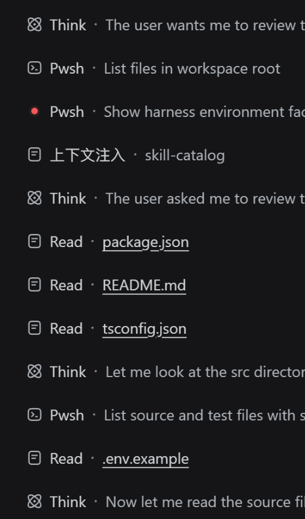
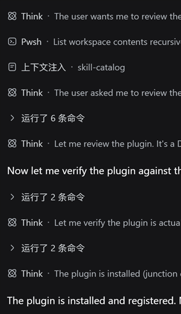

# dsh-turn-fold

> **简体中文**（默认） | [English](README.en.md)

> 受够了几十条工具调用占满屏幕？
> 也眼馋隔壁 Codex 的自动折叠？
> 那这个插件就是为你准备的。

DeepSeek Harness（DSH）**纯插件**，只负责**折叠**：
1. **段级分组自动折叠**：两个 text 之间的所有工具调用和 Think 收成**一个段级组头**，**默认折叠**；运行中段组头动态显示「正在运行 Xxx · 描述 / 正在思考 · 内容」，下一个 text 出现后变成「运行了 N 条命令」（Think 不算命令数）。
2. **运行中大组头**：大组头在 agent 回复开始就出现，随回复逐条加载，组头实时显示耗时/token/tok/s/缓存命中率；组头与内容之间有分隔线。
3. **整回合折叠**：一轮回复完成后自动收成**一个大组头**（默认收起），最终总结只显示正文。
4. **手动展开/收起**：点击组头切换。

**不修改任何 `@deepseek-ai/dsh-*` 源码。**

## 功能一：段级分组自动折叠

```
text：先看仓库状态和改动规模：                        ← text 直接显示
┌────────────────────────────────────────────────────┐
│ › 正在运行Pwsh · Commit 1: core +tests             │  ← 运行中：动态显示当前执行的工具
└────────────────────────────────────────────────────┘
text：……                                             ← 下一个 text 出现
┌────────────────────────────────────────────────────┐
│ › 运行了 3 条命令                            [3]    │  ← 段闭合：显示命令数（Think 不算）
└────────────────────────────────────────────────────┘
```

- **段 = 两个 text 之间的内容**：连续的工具调用与 Think 混排成一段（Think 不再打断分组），
  含 text 的消息是段边界，text 本身始终直接显示。
- **默认折叠**：段级组头**始终默认收起**（运行中也不例外）——运行中只显示 text 和段组头行，
  工具卡片/Think 内容点击段组头才展开。
- **运行中动态标题**：段未闭合（下一个 text 还没出现）时，段组头显示段内最后一个节点——
  工具调用显示「正在运行 `工具名` · 参数摘要」（如 `正在运行Pwsh · Commit 1: core +tests`），
  Think 显示「正在思考 · 最新一行」（与官方 ReasoningRow 同款：取最新一行、横向自动滚动
  跟随末尾、带高光扫过动画，内容随流式逐字推进）。
- **段闭合标题**：下一个 text 出现后，段组头变成「运行了 N 条命令」（N = 段内工具调用数，
  Think 不算）；纯 Think 段（无工具调用）闭合后显示「思考」。
- **手动可展开/收起**：点击段组头切换；手动选择会覆盖自动规则。
- **失败命令标红**：组内已有命令**执行失败**（工具结果 `isError`，含中断）时，组头文字变红，并在
  「运行了 N 条命令」后追加失败数，如 `运行了 6 条命令——2条执行失败`。

### 效果示意

折叠前后对比（左：工具调用全部展开、逐条显示；右：下一个 text 出现后自动收成段级组头）：

<table>
  <tr>
    <td align="center"><b>折叠前</b></td>
    <td align="center"><b>折叠后</b></td>
  </tr>
  <tr>
    <td align="center"></td>
    <td align="center"></td>
  </tr>
</table>

## 功能二：运行中大组头 + 整回合折叠成一个大组头

```
[用户消息]
[▸ 耗时5分12秒，消耗12345token，34tok/s，缓存命中80%]   ← 回复开始即出现的大组头
─────────────────────────────────────────────          ← 分隔线
[Think / 工具调用逐条加载…]                             ← 运行中默认折叠成段级组头
[最终总结正文]                                           ← 无 Think 行，只有正文
[耗时 · token 脚注]                                      ← 官方 turn-tail
```

- **回复开始即出现大组头**：agent 回复的第一条内容出现时，大组头就出现在回复顶部，
  默认展开，后续 Think / 工具调用在分隔线下方逐条加载——不用再等回合结束才看到指标；
- **指标实时更新**：大组头中的**耗时秒数每秒走动**（从回合 `turn/start` 起计时），
  **"消耗token"按随机间隔（默认 125~250ms）刷新且持续增长**，tok/s 按已输出 token / 已耗时实时估算，
  缓存命中率随 usage 实时计算；回合结束后全部切换为官方权威值（turn-tail 的 tok/s、
  `turn/end` 的精确耗时）；
- **"消耗token"持续增长动画**：真实 usage 只在每个请求完成时到达，两次之间数字会
  停住——运行中在真实基线之上叠加纯展示用的动画偏移，偏移按实际 tick 次数推进
  （**+1/+11 交替**：个位每 tick +1、十位每 2 tick +1、更高位随进位自然走动），
  tick 间隔 = `liveTickMs` × 随机数（`liveTickJitter` ~ 1，默认 125~250ms），
  数字跳动节奏不规律，更像真实生成速率而不是节拍器；真实 usage 到达时只把基线校
  正为真实值，偏移继续累计、数字只增不减。基准间隔和抖动分别通过 `CONFIG.liveTickMs`
  和 `CONFIG.liveTickJitter` 调整；
- **滚轮式数字动画**：运行中数值变化时，每一位数字独立"滚动"到新值（里程表/滚轮效果，
  回弹缓动；动画时长按变化频率自适应：token 个位这类快速变化用略短于刷新周期的短动画
  保证每拍完整走完，耗时秒数等慢速变化用 350ms 回弹滚动）——数字拆成逐位视窗、内部
  竖排 0-9，视觉上像计数滚筒；完整文案另有 sr-only 副本，读屏/无障碍不受影响，
  系统开启「减少动态效果」时自动退化为静态数字；
- **组头下方常驻分隔线**：大组头文字下方始终有一条 1px 水平细线
  （颜色取官方 `--dsw-alias-line-secondary` token，随主题明暗自动适配），
  **收起/展开都显示**，展开时同时充当组头与内容的视觉分界；
- 一轮回复**完成**（输出最终总结、回合结束）后，大组头自动收起，本回合内所有 Think、
  工具调用和上下文注入收进大组头，只保留最终总结消息和官方耗时/token 脚注可见；
  （手动展开过的回合保持展开状态）
- **无工具调用也折叠**：回合内只有上下文注入 / Think、没有任何工具调用时，同样收成
  一个大组头（组头显示耗时/token 指标，不显示命令数）；
- **大组头显示本轮指标**：`耗时x时x分x秒（不足 1 小时只显示分秒，不足 1 分钟只显示秒），
  消耗xxx token，xxx tok/s，缓存命中 xx%`；某几项缺失时自动省略，全部缺失才回退为
  「运行了 N 条命令」；
- 点击大组头展开/收起整轮内容；重新打开历史会话时，已完成的回合同样保持整回合折叠；
- **折叠作用域不越过用户消息**：大组头只折叠「用户消息之后、agent 回复之间」的内容。
  锚定在用户消息**上方**的上下文行（如审批策略变更通知）不属于本回合输出区间，
  始终保持原样可见，绝不参与折叠，也不会被当作组头锚点——避免大组头「跨过」用户消息
  去折叠其上方的内容；
- **最终总结只显示正文**：回合结束后，最终总结消息内部自带的 Think 行也一并隐藏；
- **状态标签**：非正常结束的回合（用户停止 / 中断）在大组头前置状态文本，
  如「已停止 | 耗时5分12秒…」，正常完成不显示额外标签；
- **单条也分组**：两个 text 之间只有 **1 条**命令（或 1 个 Think）时同样套段级组头，
  运行中显示「正在运行 Xxx · …」、text 出现后显示「运行了 1 条命令」；
  回合结束整回合折叠时它收进大组头，展开大组头后段级组头行可见。

### 效果示意

回合结束后，整回合收成一个带指标的大组头，只保留最终总结正文：


## 组件样式与行距

- **组头即官方样式**：组头直接复用官方 `DisclosureRow` 原语（`@deepseek-ai/dsh-client-ui-primitives`）
  渲染——24px 行高、16px 前导、官方 14px chevron（收起右向 / 展开下向）、14px/24px 标题，
  与 Think / 工具卡片的折叠行逐像素一致；
- **大组头分隔线**：组头下方常驻一条 1px 水平细线（`.ccg-turn-divider`，颜色取官方
  `--dsw-alias-line-secondary` token），收起/展开都显示，上下留白 4px / 8px；
- **紧凑行距**：折叠组只占一行（24px）；被折叠的成员节点整行 `display:none`，不会残留空行，
  行距与官方消息完全一致（column 的 16px 节奏），折叠再多也不会越空越大；
- **过渡动画**：展开时内容从 0 高度平滑展开到真实高度（JS 测量 + Web Animations API）+ 淡入 + 微位移（280ms）；
  收起时播放收缩动画（200ms）后卸载内容；系统开启「减少动态效果」时自动禁用动画；
  回合运行中（直播模式）内容高度自适应，不裁切不断增长的流式内容；
- **滚轮数字**：运行中大组头的数字（耗时/token/tok/s/缓存命中）按数位拆成 1ch 宽的
  滚动视窗，数值变化时逐位滚动（350ms 回弹缓动）；回合结束后回退纯文本；
- **多语言**：界面文案按浏览器语言自动适配简体中文 / 英语；
- **无障碍**：组头带 `aria-label` / `aria-expanded`，键盘可操作（Enter / Space 切换）。

## 安装

### 方式一（推荐）：从 npm 安装

本插件已发布到 npm registry：[dsh-turn-fold](https://www.npmjs.com/package/dsh-turn-fold)

```sh
# 官方命令（推荐）
dsh plugin --profile web add dsh-turn-fold

# 或从 GitHub 源码安装
dsh plugin --profile web add github:Winter-And-You-Gone/dsh-turn-fold
```

`dsh plugin` 会将包加入 profile 的 pnpm 依赖并自动追加到组合包层（`dsh.profile.bundles`），无需手动改任何文件。验证方式：

```sh
dsh --profile web --dump-config    # 确认输出中能看到 "dsh-turn-fold" 层
```

然后**完全退出 DSH 进程并重启**。

### 方式二：手工 `install.ps1`

```powershell
# 把插件目录放到你已有的插件目录，然后：
.\install.ps1 -PluginSource "<你的插件目录>"
# 例如：.\install.ps1 -PluginSource "C:\dsh-plugins\dsh-turn-fold"
# 不传参数时默认用脚本自身所在目录作为插件源
```

脚本会：
1. 在 `~/.dsh/profiles/node_modules/dsh-turn-fold` 建 **Junction** 指向插件目录；
2. 在 `~/.dsh/profiles/web/cordis.patch.yml` 追加一行 `- insert:` 注册；
3. 校验 `require.resolve` 可解析。

然后**完全退出 DSH 进程并重启**。

## 卸载

```sh
# 官方方式：同时移除依赖和插件层
dsh plugin --profile web remove dsh-turn-fold
```

手工方式（曾用 `install.ps1` 安装时）：

```powershell
Remove-Item "$env:DSH_HOME\profiles\node_modules\dsh-turn-fold" -Force   # 删 Junction
# 手动删掉 cordis.patch.yml 里对应的 insert 块
```

## 测试

```sh
npm install        # 首次：安装 jsdom / react / react-dom（devDependencies）
npm test           # node --test 运行 tests/ 下的全部测试
npm run check      # 语法检查 client.js / index.js
```

测试套件（`tests/`）直接加载真实 `client.js`（经 `__ModuleLoader__` 注入 + `__test`
导出，无复制粘贴漂移），分四层：

| 文件 | 覆盖 |
| --- | --- |
| `unit.logic.test.mjs` | 纯函数：`computeGroup` 段级分组、`computeTurnFold` 整回合折叠、`computeTurnMetrics` / `turnHeaderLabel` 指标文案、`turnNumber` 定位；含历史 verify-fix 的全部场景与真实会话数据（TURN13） |
| `unit.render.test.mjs` | React 渲染：初始折叠 → 点击大组头展开 → 再收起 的完整交互；内置组件委托渲染时 `useHostDescription` 等 kit hook 的透传；条目注册契约（inject 声明） |
| `unit.css.test.mjs` | CSS `:has()` 隐藏规则在真实 DOM 上的生效（含"展开→收起"往返） |
| `regression.test.mjs` | 历史 bug 回归：节点对象替换（Bug1）、inject 缺失崩溃/abdicate（Bug2）、无工具调用回合折叠（v0.2.3）、折叠作用域不越过用户消息（v0.2.2）、段级分组手动展开/收起 |

> 在 Windows 沙箱等无法 spawn 子进程的环境下需要 `--test-isolation=none`（已在
> `npm test` 中内置）；普通 Linux/macOS CI 同样可用该参数（Node ≥ 22.9）。

## CI 与发布

GitHub Actions 会在每次 PR / push 到 `main` 时自动运行语法检查、`npm test` 全套测试和
`npm pack --dry-run` 打包预检；推送 `v*` tag 时自动发布到 npm（OIDC Trusted Publishing，
无需长期 token）并创建 GitHub Release。

**一次性配置**（把 npm 包绑定到本仓库的 release workflow）：

```sh
npx npm@^11.15.0 trust github dsh-turn-fold \
  --repo Winter-And-You-Gone/dsh-turn-fold \
  --file release.yml \
  --allow-publish
```

也可以改为在 npmjs.com 网站账户设置里配置 Trusted Publishing。

**之后每次发版只需两步**：

```sh
npm version patch    # 或 minor / major：bump 版本并自动打 v* tag
git push --follow-tags
```

> 提示：`npm version` 要求工作区干净，先把待发布的改动提交；tag 名必须与
> `package.json` 的 `version` 一致（workflow 会校验，不一致即失败）。

## 工作原理（为什么不用改源码）

- DSH 会话 UI 是 Cordis 插件 + Slot 插槽系统拼出来的；聊天流每个块经
  `conversation.chat.node`（keyed slot）按类型分发渲染器。
- Slot 注册器官方支持 **不同 priority 覆盖**（`register at a different priority to shadow it, lowest renders`）。
  本插件用 `priority: -1` 覆盖内置的 `tool-call` / `assistant-step` / `context` 渲染器。
- 展开时通过 `ctx.slots.entries('conversation.chat.node')` 取到内置组件引用做**委托渲染**，
  工具卡片/Think 行/上下文注入的内容与样式与内置完全一致。
- 整回合折叠通过会话快照的 `turnEnds`（turn/end 事件驱动）判定回合完成，配合
  `chat.locations.getTurn()` 计算组头/成员/最终消息，再以 CSS `:has()` 隐藏成员 flowItem。
  回合运行中由 `turnTimings`（turn/start 事件给出 `startTime`）判定回合已开始，
  大组头即出现：耗时用随机间隔时钟（每 `CONFIG.liveTickMs` × 0.5~1，默认 125~250ms）
  补 `Date.now()` 实时走动，"消耗token"在真实值之上叠加每 tick +1/+11 交替的动画
  偏移持续增长（真实 `usage` 到达时校正基线），全部指标在 `turn/end` 后切换为权威值。

## 注意事项

- DSH 升级若改变上述槽位契约或内置组件 props，本插件可能需要随版本小改（属插件维护，非改源码）。
- 组头文案在 `client.js` 顶部 `CONFIG` 可调。
